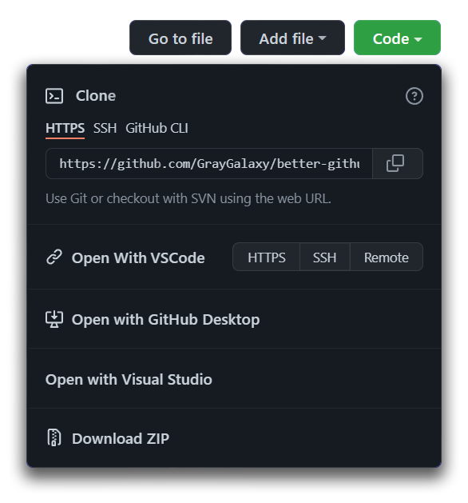
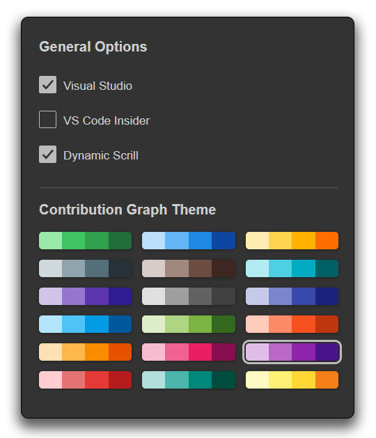

# Better GitHub ![][sh_chrome]

![][sh_gh_stars] ![][sh_version] [![][sh_downloads]][release]

Make the GitHub UI better and more useful.

This extension combines features from popular extensions for GitHub in a single package.

Give it a star if you love the extension.

You can download the extension form following [link][release].

## Features

This extension comes with a few features that will enhance your GitHub experience.\
You can Enable/Disable any feature from the options page.
- Sticky Sidebar
- Dynamic scroll on sidebar\
  <small>(like sidebar on Twitter)</small>
- Contribution graph color themes
- Material Icon theme for folders
- Open with VS Code Button

_Note: Some of the features are not available yet_

## Screenshots

## Extension Option

The extension has a beautiful Options UI. It helps to manage all the functions as needed.\
You can enable or disable any option you need.\
To open the options, follow these steps
- **Right-click** on the Extension Icon
- Click **Extension Option**
- Choose your desired Features

[&#x21e1; Back to top](#)

  
Made with 💖 in India.

<!-- Links -->

[release]: https://github.com/GrayGalaxy/better-github/releases ' '

<!-- Shields -->

[sh_gh_stars]: https://img.shields.io/github/stars/GrayGalaxy/better-github.svg?logo=github&label=Stars
[sh_chrome]: https://img.shields.io/badge/-Chrome-black?logo=google-chrome&logoColor=white
[sh_version]: https://img.shields.io/github/manifest-json/v/graygalaxy/better-github/main?label=Version
[sh_downloads]: https://img.shields.io/github/downloads/GrayGalaxy/better-github/total?label=Downloads
